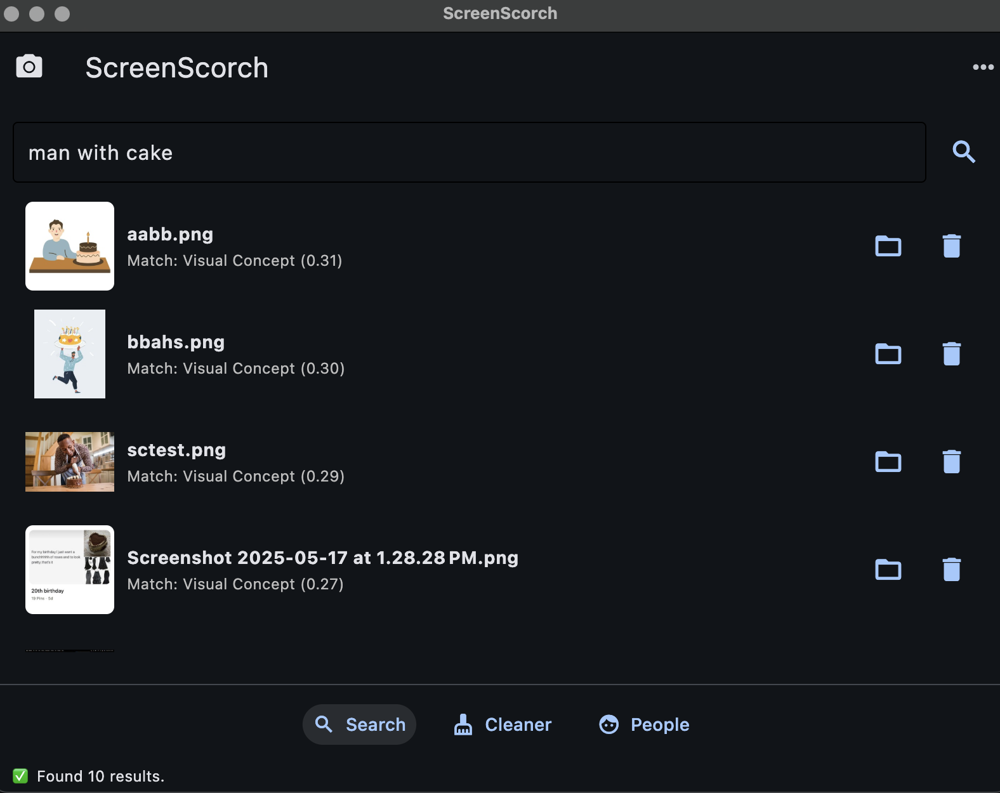
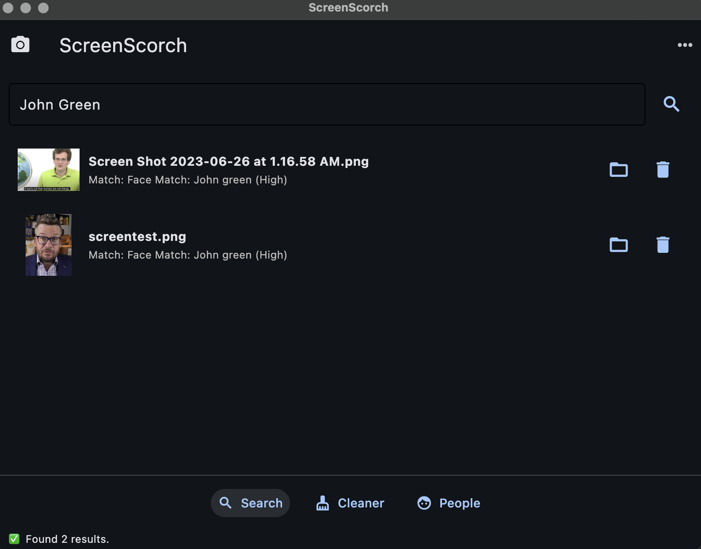
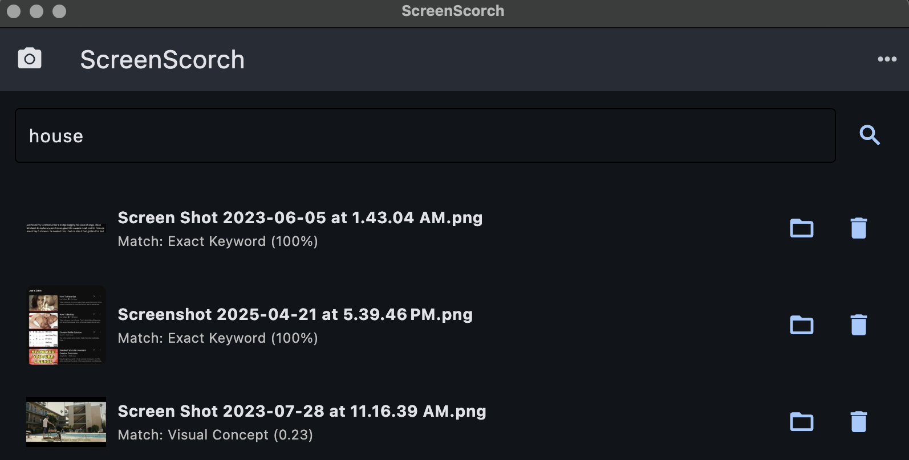

# ScreenScorch


**Your personal, private, and intelligent search engine for every photo and screenshot on your computer.**
---
Find any image using natural language, text, or even the people in them. Clean up duplicates, organize your collection, and rediscover your memories—all with a beautiful desktop app that runs 100% locally.

---

### One Search Bar. Endless Possibilities.

ScreenScorch understands what you're looking for, whether it's visual concepts, text inside the image, or a person's name.


### Core Features

-   ✅ **Intelligent Multi-Modal Search**: A single search bar that understands everything about your images.
    -   **Search by Content**: Find images based on what's in them. *e.g., "a man with cake".*
    -   **Search by Text (OCR)**: Instantly find screenshots containing specific words. *e.g., the word "house" inside an article.*
    -   **Search by People**: The app automatically finds faces. Tag them once, and you can instantly find every photo of that person just by typing their name, like *"John Green"*.

-   ✅ **Powerful Cleaner**: Reclaim gigabytes of disk space with ease.
    -   Finds **bit-for-bit exact duplicates** for safe and easy removal.
    -   Finds **visually similar (near-duplicate)** images, grouping them together for you to review.

-   ✅ **Face Recognition & Tagging**:
    -   Automatically detects untagged faces across your entire library.
    -   A dedicated "People" view lets you quickly assign names to faces.
    -   Build a searchable library of friends and family that is completely private to you.

-   ✅ **Efficient & Incremental Indexing**:
    -   The first import builds your library. Subsequent imports are lightning-fast, only processing new or changed files.
    -   Automatically prunes the index to remove entries for files you've deleted.

-   ✅ **100% Local and Private**: Your photos, your data, and your search index **never leave your machine**. No cloud servers, no data collection, no subscriptions. Ever.

### How It Works

ScreenScorch performs a one-time, comprehensive analysis on each new image you import. This all happens locally on your computer.

1.  **Indexing**: When you import a folder, the app scans each image and extracts multiple layers of information:
    -   **Optical Character Recognition (OCR)** reads all visible text.
    -   **CLIP Embeddings** create a mathematical representation of the image's visual content.
    -   **Face Recognition** detects the location of any faces and generates a unique signature for each one.
    -   A high-quality thumbnail is generated for fast UI previews.

2.  **Searching**: When you type a query, ScreenScorch uses this rich index to find the best match across all modalities—text, content, and people—and presents the most relevant results instantly.

### Getting Started

**1. Prerequisites:**
You must have [Homebrew](https://brew.sh/) installed. Then, use it to install Google's Tesseract OCR engine:
```bash
brew install tesseract
```
**2. Clone the Repository:**
```bash
git clone <your-repo-url>
cd screenscorch
```
**3. Set Up the Environment:**
```bash
# Create and activate a virtual environment
python3 -m venv venv
source venv/bin/activate

# Install all required libraries
pip install -r requirements.txt
```
**4. Run the App:**
```bash
flet run app.py
```
### How to Use the App
1. **First Import:** On the first launch, you'll see a welcome screen. Click "Import your first folder" and use the built-in browser to select a starting directory. You can also use the `...` menu in the top-right to import folders or scan your entire computer at any time.
2. **Searching:** Once indexing is complete, use the main search bar in the "Search" tab. Type anything you can remember about the image.
3. **Cleaning:** Navigate to the "Cleaner" tab. The app will automatically scan for duplicates. Review the groups, check the boxes next to the files you want to remove, and click "Move Selected to Trash".
4. **Tagging People:** Go to the "People" tab. The app will show you all the untagged faces it has found. Click on a face, enter a name, and save. From then on, you can find that person in the main search bar by typing their name.
### Technology Stack
- **GUI Framework:** [Flet](https://flet.dev/) (powered by Flutter)
- **AI/ML:** 
    - `Sentence-Transformers` (for CLIP visual embeddings)
    - `face_recognition` (for face detection and encoding)
    - `PyTorch`
- **OCR Engine:** Google's Tesseract
- **Image Processing:** Pillow, imagehash
- **File System:** send2trash
### Roadmap & Future Ideas

- **Advanced Search Filters:** Add filters to narrow search results by date range, image size, or file type.
- **Manual Tagging System:** Allow users to add arbitrary text tags (#work, #receipt, #idea) to images for even better organization.
- **Cross-Platform Support:** Adapt the "Import All" feature to work on Windows (using Windows Search) and Linux.
- **Video File Support:** Extend indexing capabilities to include video files, making them searchable by content or audio transcripts.

### License

This project is licensed under the MIT License. See the `LICENSE` file for details.


### Examples 
<b>Search by Visual Concept</b>

---
<b>Search by People</b>

---
<b>Search by Text & Content</b>

---